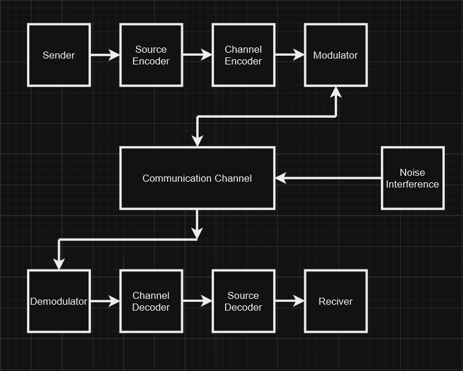

## Need for Modulation, Explanation of why modulation is essential in communication systems.

-   Frequency Multiplexing
    -   By modulating different signals onto different carrier frequencies, multiple signals can coexist on the same channel without interfering with each other. This enables Frequency Division Multiplexing (FDM).
-   Improved Signal Strength
    -   High-frequency signals experience less attenuation compared to low-frequency signals during transmission. Modulation helps minimize the loss of signal strength.
-   Reduced Antenna Size
    -   The size of an antenna is inversely proportional to the frequency of the signal. Modulating a signal to a higher frequency reduces the required antenna size, making the system more practical for real-world use.
-   Noise Reduction
    -   Modulation techniques such as Frequency Modulation (FM) and Digital Modulation improve immunity to noise and interference, ensuring better signal quality.
-   Compatibility with Transmission Mediums
    -   Different mediums have different frequency ranges for optimal performance. Modulation matches the signal frequency to the appropriate range for the medium used, e.g., radio waves, optical fibres, or coaxial cables.
-   Broadcasting
    -   Modulation enables the broadcasting of signals to multiple users, especially in radio and television systems, by assigning unique carrier frequencies to different stations.

## IEEE or Electromagnetic Spectrum (EMS) or Frequency Chart, Overview of the electromagnetic spectrum and frequency allocation as per IEEE standards.

-   The Electromagnetic Spectrum (EMS) refers to the range of all possible electromagnetic radiation frequencies, from very low frequencies (radio waves) to extremely high frequencies (gamma rays).
-   Each part of the spectrum has specific applications in communication, industry, and research.
-   The IEEE plays a crucial role in defining standards for frequency allocation to ensure efficient and interference-free communication.

### Overview of the Electromagnetic Spectrum

| **Type of Wave** | **Frequency Range** | **Wavelength Range** | **Applications**                                       |
| ---------------- | ------------------- | -------------------- | ------------------------------------------------------ |
| Radio Waves      | 3 Hz – 300 MHz      | 100 km – 1 mm        | Broadcasting, mobile communication, radar, GPS         |
| Microwaves       | 300 MHz – 300 GHz   | 1 m – 1 mm           | Satellite communication, Wi-Fi, microwave ovens        |
| Infrared (IR)    | 300 GHz – 400 THz   | 1 mm – 750 nm        | Remote controls, thermal imaging, data transmission    |
| Visible Light    | 400 THz – 800 THz   | 750 nm – 380 nm      | Optical communication, photography, vision systems     |
| Ultraviolet (UV) | 800 THz – 30 PHz    | 380 nm – 10 nm       | Sterilization, fluorescent lamps, medical applications |
| X-Rays           | 30 PHz – 30 EHz     | 10 nm – 0.01 nm      | Medical imaging, material analysis                     |
| Gamma Rays       | Above 30 EHz        | Less than 0.01 nm    | Cancer treatment, nuclear studies, astrophysics        |

### Frequency Range and Applications IEEE Radio Frequency

| **Frequency Range** | **Wavelength Range** | **Name**                | **Applications**         |
| ------------------- | -------------------- | ----------------------- | ------------------------ |
| 3 Hz - 300 Hz       | \( 10^7 - 10^6 \)    | Extremely Low Frequency | Power line communication |
| 300 Hz - 3 kHz      | \( 10^6 - 10^5 \)    | Voice Frequency         | Speech communication     |
| 3 kHz - 30 kHz      | \( 10^5 - 10^4 \)    | Very Low Frequency      | Submarine communication  |
| 30 kHz - 300 kHz    | \( 10^4 - 10^3 \)    | Low Frequency           | Marine communication     |
| 300 kHz - 3 MHz     | \( 10^3 - 10^2 \)    | Medium Frequency        | AM broadcast             |

## Comparison of Communication Channels by Factors

| **Factor**              | **Wired**                                      | **Wireless**                                   | **Optical**                                   | **Satellite**                                 |
| ----------------------- | ---------------------------------------------- | ---------------------------------------------- | --------------------------------------------- | --------------------------------------------- |
| **Medium**              | Twisted pair, coaxial cables, fibre optics     | Radio waves, microwaves, infrared              | Light waves (fibre optics, FSO)               | Satellites in orbit                           |
| **Bandwidth**           | High                                           | Moderate to high                               | Very high                                     | Moderate                                      |
| **Range**               | Limited (up to several kilometres)             | Variable (local to global)                     | Long-distance (up to thousands of kilometres) | Global                                        |
| **Mobility**            | Fixed                                          | High                                           | Limited                                       | High                                          |
| **Signal Interference** | Minimal                                        | Prone to electromagnetic interference          | Immune                                        | Susceptible to weather-related issues         |
| **Installation Cost**   | Moderate to high                               | Low to moderate                                | High                                          | Very high                                     |
| **Maintenance**         | Moderate                                       | Low                                            | High                                          | High                                          |
| **Security**            | High                                           | Moderate (vulnerable to hacking/interception)  | High                                          | Moderate (susceptible to unauthorized access) |
| **Reliability**         | Very high                                      | Moderate to high                               | Very high                                     | High                                          |
| **Applications**        | Broadband internet, LANs, telephones, cable TV | Mobile networks, Wi-Fi, IoT, remote monitoring | Internet backbone, long-distance phone lines  | GPS, global communication, weather monitoring |

## Digital Communication

### Components in a Digital Communication System Block Diagram

A digital communication system transmits information as discrete signals. Below is an explanation of each component in the block diagram:

| **Component**             | **Explanation**                                                                                        |
| ------------------------- | ------------------------------------------------------------------------------------------------------ |
| **Sender**                | - Generates the message or data to be transmitted.                                                     |
|                           | - Examples: Text, voice, video, or sensor data.                                                        |
| **Source Encoder**        | - Converts the raw message into a digital format (binary data).                                        |
|                           | - Compresses the data to remove redundancy and save bandwidth.                                         |
| **Channel Encoder**       | - Adds error-correcting codes to the data for robustness against transmission errors.                  |
|                           | - Helps detect and correct errors at the receiver.                                                     |
| **Modulator**             | - Converts binary data into waveforms suitable for transmission over the channel.                      |
|                           | - Techniques: Amplitude Shift Keying (ASK), Frequency Shift Keying (FSK), or Phase Shift Keying (PSK). |
| **Communication Channel** | - The medium through which the signal travels, such as wired (fibre optics) or wireless (radio waves). |
|                           | - It may introduce noise, distortion, or interference to the signal.                                   |
| **Demodulator**           | - Converts the received waveforms back into binary data.                                               |
|                           | - Detects the original symbols sent by the modulator.                                                  |
| **Channel Decoder**       | - Removes the error-correcting codes to retrieve the original message.                                 |
|                           | - Corrects any detected errors using parity checks or advanced algorithms.                             |
| **Source Decoder**        | - Reconstructs the original message from the encoded binary data.                                      |
|                           | - Decompresses the data to restore its original form.                                                  |
| **Receiver**              | - Displays or processes the reconstructed information.                                                 |
|                           | - Examples: Screen for video, speaker for audio, or memory for data storage.                           |

### Block Diagram

### Advantages

-   Better Security
-   Higher Bandwidth Efficiency
-   More Noise Immunity
-   Error Detection is Easier
-   Multiplexing is Possible
-   Improved Quality
-   Faster and Easier Processing
-   Highly Scalable
-   Better Compatible
-   Cheaper and Cost-Effective
