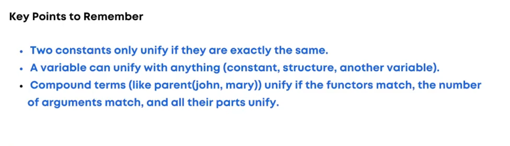

# Logic Programming

## Introduction:

Logic programming is a programming paradigm based on formal logic. In logic programming, programs are written as a series of logical statements, and computation is performed by querying these statements. Unlike imperative programming, where you specify how to do things step-by-step, in logic programming, you define **what** the problem is, and the system determines **how** to solve it based on logical rules and facts.

Logic programming is commonly used in artificial intelligence and computational linguistics. The most well-known logic programming language is **Prolog** (Programming in Logic), which is based on formal logic.

---

## Key Concepts in Logic Programming:

Logic programming consists of three key elements:

1. **Facts**
2. **Rules**
3. **Queries**

Let's discuss each of these concepts in detail:

### 1. Facts

Facts represent basic truths about the world in a logic programming language. A fact is a statement that is unconditionally true. These are the fundamental building blocks of a logic program.

#### Example of a Fact:

In a knowledge base about family relationships, you can define facts such as:

```prolog
father(john, mary).    % John is the father of Mary.
mother(susan, mary).   % Susan is the mother of Mary.
```

These facts establish relationships between entities (like "John" and "Mary"). In Prolog, a fact is a statement that doesn't need to be further explained or proved.

### 2. Rules

Rules define relationships between facts. They specify how certain facts can be derived from other facts. Rules consist of a head (the conclusion) and a body (the conditions that need to be satisfied for the conclusion to be true).

A rule is written in the form of a logical implication. It is a conditional statement: if certain conditions are met, then a certain conclusion follows.
Example of a Rule:

If someone is the father of a child and someone is the mother of the same child, then that someone is the parent of the child.

```prolog
parent(X, Y) :- father(X, Y).  % If X is the father of Y, then X is a parent of Y.
parent(X, Y) :- mother(X, Y).  % If X is the mother of Y, then X is a parent of Y.
```

Here, parent(X, Y) is the head (the conclusion), and father(X, Y) or mother(X, Y) is the body (the condition for being a parent).

### 3. Queries

Queries are questions asked to the logic programming system to infer new information from the existing facts and rules. A query is used to ask the program if a particular fact is true or if certain conditions can be satisfied.

A query asks the system to search through the facts and rules to determine if a given statement can be derived.
Example of a Query:

Now, suppose you want to know whether John is a parent of Mary:

```prolog
?- parent(john, mary).
```

### 4. Complete

```prolog
% Facts
father(john, mary).    % John is the father of Mary.
mother(susan, mary).   % Susan is the mother of Mary.

% Rules
parent(X, Y) :- father(X, Y).  % If X is the father of Y, then X is a parent of Y.
parent(X, Y) :- mother(X, Y).  % If X is the mother of Y, then X is a parent of Y.

% Query
?- parent(john, mary).  % Query to check if John is a parent of Mary.

```

### 5. Explanation:

- The facts state that John is Mary's father, and Susan is Mary's mother.
- The rules define that anyone who is either a father or a mother is a parent.
- The query asks whether John is a parent of Mary. The system will answer "yes" because of the facts and rules.5

# Unification

- Unification is the process of making two terms (things) the same by finding values for variables.
- It's like Prolog's way of "matching" things to see if they are equal or can be made equal.
- Unification is how Prolog answers queries and applies rules.

# Rules

- Identical Constants:

  - Two constants unify (match) only if they are exactly the same.

- Variables Can Unify with Anything:

  - A variable can unify with any term (a constant, a structure, or even another variable). Once a variable is unified with something, it keeps that value.

- Compound Terms Must Match Functors and Arity:
  - Their functors (the name in front) are the same.
  - They have the same number of arguments (arity).
  - The corresponding arguments also unify


<br>

<br>

<br>

<br>

<br>

